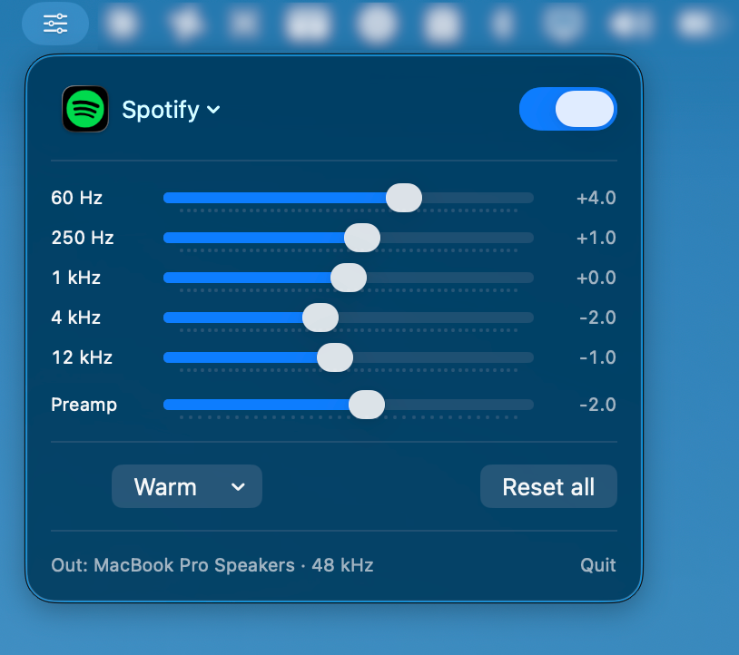
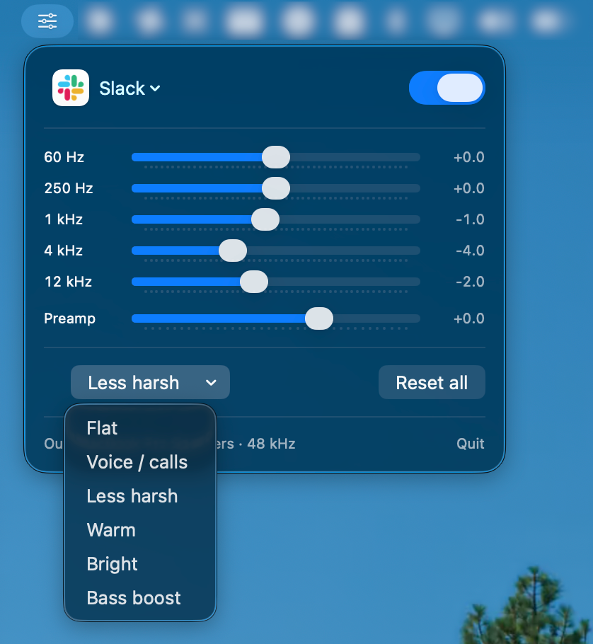

# MacEQ

A per-app equaliser for macOS. Pick an app, drag five sliders, hear the change live.
Built for fixing boomy or harsh voices on Slack calls.

No virtual audio driver, no changing your system output device, no paid software.

<p align="center">
  
</p>

## How it works

macOS 14.4+ exposes **Core Audio process taps** — the same mechanism SoundSource and
Audio Hijack use, now public API. MacEQ:

1. Creates a tap on the target app's audio, set to `mutedWhenTapped`, so the app's
   direct path to the speakers is silenced *only while MacEQ is reading it*. If MacEQ
   crashes or quits, the app goes straight back to normal audio.
2. Builds a **private aggregate device** owning both that tap (input) and your real
   output device, with drift compensation on the tap so the two clocks stay married.
3. Runs an IOProc that filters the tap audio through five biquads and writes it to the
   real output.

```
Slack ──tap (muted)──> [ 5-band biquad EQ ] ──> MacBook Speakers
Spotify ─────────────────────────────────────> MacBook Speakers
```

Everything else on the machine is untouched.

## Build

```sh
./build.sh
open MacEQ.app
```

Signing matters: macOS ties the Audio Recording permission to the code signature, so
`build.sh` signs with your `Apple Development` certificate and you grant permission
once. Without a certificate it falls back to ad-hoc signing and macOS re-asks after
every rebuild. Override with `MACEQ_IDENTITY="..." ./build.sh`.

## First run

MacEQ lives in the menu bar (no Dock icon). Click the slider icon, pick an app from
the dropdown, and macOS will ask for **Audio Recording** permission the first time.
Grant it, then reselect the app.

Apps currently making noise are marked `▸` and sorted to the top.

## Controls

| Control | Range | Notes |
|---|---|---|
| Bass | ±12 dB | 60 Hz low shelf |
| Low mid | ±12 dB | 250 Hz peaking, Q 1.0 — where "boomy" lives |
| Mid | ±12 dB | 1 kHz peaking, Q 1.0 |
| Presence | ±12 dB | 4 kHz peaking, Q 1.0 — consonants and intelligibility |
| Treble | ±12 dB | 12 kHz high shelf |
| Preamp | -12/+6 dB | Pull down when boosting, or boosts will clip |

Double-click any slider to reset it to 0, or **Reset all** to flatten everything.
Presets include **Voice / calls**, which cuts rumble and mud and lifts presence — the
usual fix for a muddy Slack call — and **Less harsh**, for the opposite problem.

<p align="center">
  
</p>

Each app gets its own saved curve, and the toggle bypasses processing without tearing
the audio graph down.

## Design notes

**Helper processes.** Electron apps do not play audio from the process that owns the
window. Slack calls come out of `com.tinyspeck.slackmacgap.helper`, Discord out of
`com.hnc.Discord.helper.Renderer`. MacEQ folds every `parent.*` bundle ID onto its
shortest known ancestor, so one row in the picker taps every helper behind it. It also
re-checks every 2 seconds and rebuilds the tap if the app spawns a new audio process —
which is exactly what starting a huddle does.

**Lock-free parameter updates.** The audio thread never allocates and never blocks.
Two coefficient blocks are pre-allocated; the UI writes the inactive one and then flips
an atomic index, so a render pass sees either the whole old curve or the whole new one,
never a torn mix.

**Buffer layouts.** Channels are resolved by walking the `AudioBufferList`, so
interleaved and planar devices both work. The tap's buffers sit *after* the output
sub-device's own input buffers in the aggregate's input list, which is why MacEQ
queries the output device's input stream count and uses it as an offset — get this
wrong on an audio interface with inputs and you tap the wrong thing.

## Distribution

**Build it yourself — that is the supported route.** MacEQ is not notarised, because
notarisation requires a `Developer ID Application` certificate, which requires the paid
Apple Developer Program. Building locally sidesteps the whole problem: `build.sh` signs
with whatever certificate you already have.

If you download a prebuilt release instead, macOS quarantines it and Gatekeeper blocks
the first launch. Two ways past that:

```sh
xattr -d com.apple.quarantine /Applications/MacEQ.app
```

or launch it once, then go to **System Settings → Privacy & Security** and click
**Open Anyway** next to the MacEQ warning. (The old right-click → Open trick was removed
in macOS 15.)

A note on permissions: the Audio Recording grant is tied to the app's code signature. A
prebuilt release binary has a stable signature, so you grant it once. If you build from
source *without* a signing certificate, the ad-hoc signature changes on every build and
macOS re-asks each time — another reason to let `build.sh` find a real certificate.

## Limitations

- Adds one buffer of latency. Irrelevant for listening; do not use it for monitoring
  yourself while recording.
- Affects **what you hear**, not what other people on the call hear. Microphone
  processing is a separate problem.
- Some apps with their own audio HAL access (a few DAWs) will not appear.
